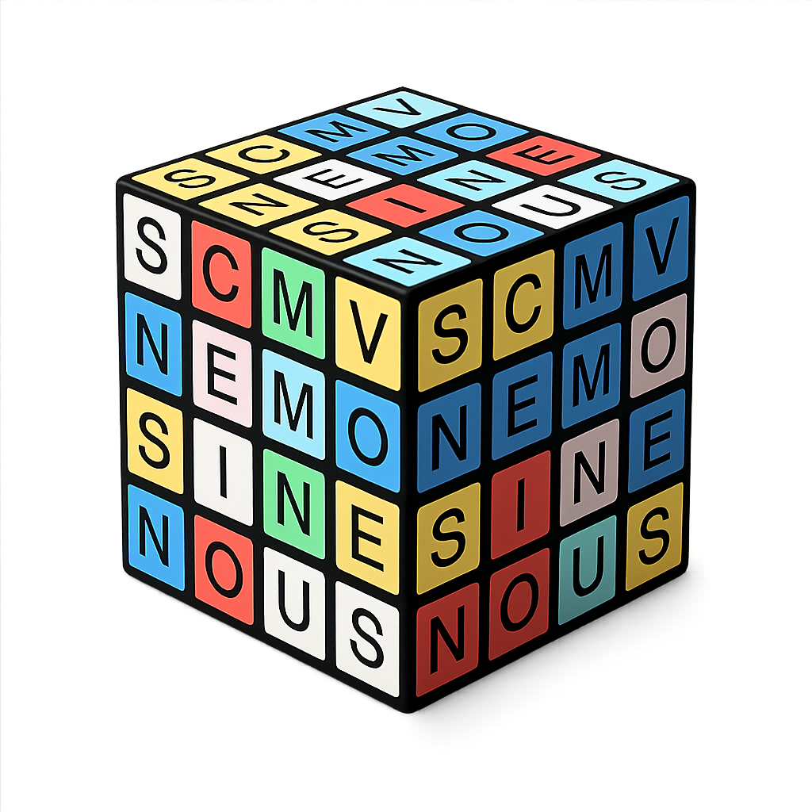

#  Nemosine | Sistema Nous

**Sistema de simulação cognitiva e arquitetura de personas baseada em LLMs.**

O **Nemosine** é uma interface avançada de chat e exploração simbólica, projetada para simular uma "mente expandida". O sistema opera através de **56 Personas** (agentes cognitivos especializados) e **22 Lugares da Mente** (ambientes simbólicos), permitindo interações profundas, contextuais e visualmente imersivas.

---

## ✨ Funcionalidades Principais

### 🎭 Arquitetura de Personas (Codex Nous)
- **56 Personas Ativas**: De arquétipos estratégicos (Estrategista, Cientista) a emocionais (Sombra, Criança), cada um com "prompt system" único (A "Alma") e contexto isolado.
- **Identidade Visual e Sonora**: Cada persona possui:
    - Retrato em alta definição.
    - Cenário de fundo (Landscape) dinâmico.
    - (Futuro) Voz neural específica.
- **Injeção de Contexto Otimizada**: O sistema gerencia dinamicamente o contexto enviado à IA (`Codex Nous` para personas, `Atlas Nous` para lugares) para maximizar a memória e reduzir custos de tokens.

### 🗺️ Lugares da Mente (Atlas Nous)
- **22 Ambientes Simbólicos**: Espaços como "Biblioteca", "Masmorra", "Jardim" e "Observatório".
- **Navegação Visual**: Interface dedicada em grade para explorar os domínios da mente.
- **Contexto Geográfico**: Ao entrar em um lugar, a IA assume a "atmosfera" e as regras daquele ambiente específico.

### 💬 Interface de Chat "Medieval-Futurista"
- **Design Imersivo**: Estética escura, fontes elegantes (Geist Mono/Sans) e elementos de UI refinados.
- **Gestão de Threads**: Crie, renomeie e exclua conversas múltiplas para manter diferentes linhas de raciocínio organizadas.
- **Painel de Dossiê Retrátil**: Visualize rapidamente a ficha técnica (Missão, Descrição, Imagem) da entidade atual sem perder o foco no chat.
- **Markdown Completo**: Respostas formatadas com tabelas, listas e código.

### 🛡️ Segurança e Privacidade
- **Chaves de API Protegidas**: Integração segura com OpenAI via variáveis de ambiente (`OPENAI_API_KEY`).
- **Modo Confessor**: Lógica preparada para áreas de privacidade e sigilo (implementação de UI em andamento).

---

## 🚀 Como Executar

### Pré-requisitos
- Node.js 18+ instalado.
- Uma chave de API da OpenAI (`sk-...`).

### Instalação

1.  **Clone o repositório:**
    ```bash
    git clone https://github.com/edersouzamelo/nemosine-04-VSCode.git
    cd nemosine-04-VSCode
    ```

2.  **Instale as dependências:**
    ```bash
    npm install
    ```

3.  **Configurar Variáveis de Ambiente:**
    Crie um arquivo `.env.local` na raiz do projeto e adicione sua chave:
    ```env
    OPENAI_API_KEY=sua-chave-aqui-sk-...
    AUTH_SECRET=gere-um-segredo-seguro
    AUTH_GOOGLE_ID=client-id-do-google
    AUTH_GOOGLE_SECRET=client-secret-do-google
    ```

    Para login Google, crie credenciais OAuth 2.0 do tipo aplicação web no Google Cloud Console e configure as URIs de redirecionamento:
    ```text
    http://localhost:3000/api/auth/callback/google
    https://seu-dominio/api/auth/callback/google
    ```
    Contas Google com e-mail verificado são associadas automaticamente a uma conta Nemosine existente com o mesmo e-mail.
    Para a integração com Google Agenda, habilite a Google Calendar API no mesmo projeto do Google Cloud. O app solicita o escopo `https://www.googleapis.com/auth/calendar.readonly` e usa os tokens OAuth salvos pelo NextAuth para listar os próximos compromissos em `/space`.

4.  **Rodar o Servidor de Desenvolvimento:**
    ```bash
    npm run dev
    ```
    Acesse [http://localhost:3000](http://localhost:3000) no seu navegador.

---

## 🛠️ Tecnologias Utilizadas

- **Core**: [Next.js 14](https://nextjs.org/) (App Router), [React](https://react.dev/), [TypeScript](https://www.typescriptlang.org/).
- **Estilização**: [Tailwind CSS](https://tailwindcss.com/).
- **IA**: [OpenAI SDK](https://github.com/openai/openai-node) (Integração com GPT-4 Turbo).
- **Gerenciamento de Estado**: Hooks personalizados e LocalStorage para persistência de sessão.

---

## 📂 Estrutura do Projeto

- `/app`
    - `/agents`: Páginas e lógica das Personas.
    - `/places`: Páginas e lógica dos Lugares.
    - `/api/chat`: Rota Server-side para comunicação segura com a OpenAI.
    - `/data`: Definições estáticas (`entities.ts`) e textos do sistema (`system_context.ts`).
    - `/lib`: Utilitários, cliente LLM e gerenciamento de sessão (`session_store.ts`).
- `/public`
    - `/agents`: Imagens de perfil e paisagem das personas.
    - `/places`: Imagens dos lugares.
    - `/audio`: (Em breve) Arquivos de voz.

---

## © Créditos e Licença

**Autor**: Edervaldo José de Souza Melo
**Licença**: Creative Commons Attribution-NonCommercial-NoDerivatives 4.0 International (CC BY-NC-ND 4.0)

*Este projeto é uma implementação técnica do Sistema Nemosine Nous.*
